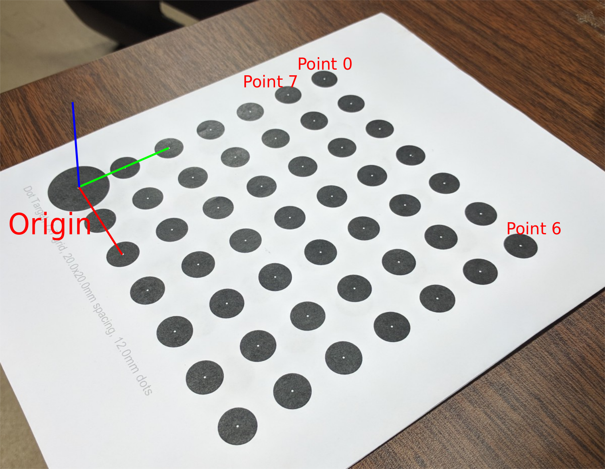

# Calibration Primer
This document discusses the "key concepts" and "terminology" that is commonly thrown around. I'll define some of these here so the documentation you find elsewhere in Robot Cal Tools makes sense.

## The General Idea
Calibrating a camera in your workspace typically happens in two steps:
 1. Calibrate the "intrinsics", the camera sensor & lens, using something like ROS' [camera calibration](http://wiki.ros.org/camera_calibration) package.
 2. Armed with the intrinsics, calibrate the "extrinsics", or the pose of the camera in your workcell.

For the second step, you need to choose the correct calibration function depending on whether your camera is moving in the workcell or watching something that moves.
 - For an RGB pinhole camera that is attached to a robot wrist, see `rct_optimizations/extrinsic_camera_on_wrist.h`.
 - For an RGB pinhole camera that is static and watching a robot, see `rct_optimizations/extrinsic_static_camera.h`.

These calibrations compute the transform between the camera and the robot wrist or base respectively. They do so by analzying images of calibration target: a
patterned set of holes with known dimensions and spacing. This target is fixed in your workcell for camera to wrist calibrations, and attached to the wrist for
camera to robot base calibrations.

For each image, the calibration starts with a guess about where your camera is and estimates what it *should have* have seen based on the guess. This estimate
is then compared with what it actually saw, and the guess is adjusted to bring it closer to reality.

## Terminology
 - **Extrinsic Parameters**: "the extrinsic parameters define the position of the camera center and the camera's heading in world coordinates" [\[ref\]](https://en.wikipedia.org/wiki/Camera_resectioning#Extrinsic_parameters). An extrinsic calibration thus tries to find WHERE your camera is relative to some frame of reference, usually the base of a robot or the wrist of a robot.
 - **Intrinsic Parameters**: When talking about cameras, these parameters define *how* points in 3D space are projected into a camera image. They encompass internal properties of the camera sensor and lens such as focal length, image sensor format, and principal point. An intrinsic calibration tries to solve these
 - **Rectified Image**: Real world cameras and their lenses are NOT perfectly described by the pinhole model of projection. The deviations from that model, called *distortions*, are estimated as part of *intrinsic calibration* and are used in software to produce an "undistorted" image called the *rectified image*. Most of the calibrations in this package assume they are operating on such a rectified image. The ROS  [image_proc](http://wiki.ros.org/image_proc) package will usually do this for you.

## The Camera
 - We use the OpenCV model. See [OpenCV's discussion](https://docs.opencv.org/2.4/modules/calib3d/doc/camera_calibration_and_3d_reconstruction.html) at the top of their calib3d module.
 - In brief: +Z looks "down the barrel" of the camera lens, +Y looks down the vertical axis, and +X looks from left to right along  the horizontal axis.
 - Most of the calibrations in this package assume they are working on an undistored or rectified image.

**TODO IMAGE OF CAMERA COORDINATES ON A PHYSICAL CAMERA**

## The Target
- The core calibrations don't make assumptions about the target: Instead you just provide 2D to 3D correspondences however you find them.
- However I do provide a default target finder in `rct_image_tools`. The type of target compatible with this package is a grid of circles with a single larger dot in the bottom left corner.
- The big dot means you know what angle you're looking at the target from. 
- The big dot is the "origin" or (0,0,0) of the target. The +Z axis comes out of the page, the +X axis runs along the bottom of the page, left to right (the last row if your big dot is in the bottom left). The +Y runs up the page from the big dot.

**NOTE**: You can create targets with custom size and spacing using the handy script, `calibration_target.py` found in `rct_image_tools/script`. Thanks to Jeremy Zoss for making this.

## Some Advice
 - Take lots of samples in lots of different positions. It's not uncommon to require tens of images from all over your workspace to get a good calibration.
 - Just because a calibration converges *does not* mean it is accurate. Just because a calibration converged to a low final cost *does not* mean it's a good calibration. If you take 3000 images from the exact same position, you'll get good convergence, a very low score, and really crappy calibration.
 
