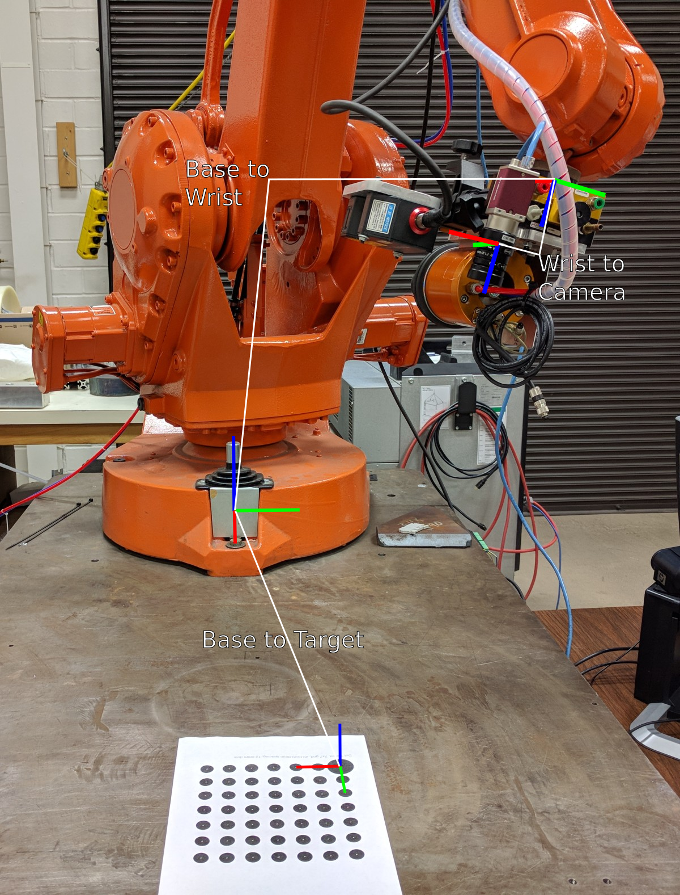

# Robot Calibration Tools Examples
## Introduction
Calibrate your camera intrinsically first. See the front page readme and calibration primer for more information.

This document describes, with pictures, the "experimental setup" for common calibrations.

Note that the source folder contains both stand-alone examples and tools meant to make testing/offline processing easier.

If you're new and want the minimal example for integrating this library with your code, see `src/examples/`.

***

## Extrinsic Camera on Wrist
#### Goal
Find the transform from the robot wrist, *tool0*, to the camera.
 
#### Workcell Setup


Sorry for the paint drawings, but I hope it gets the idea across. Note the orientation of the coordinate for the target and camera. Using these, reasonable initial guesses for the calibration parameters would be:

**wrist to camera**
```
translation = [-0.2, 0, 0.2];
rotation = 
	 [0,  1,  0,
	 -1,  0,  0,
	  0,  0,  1];
``` 

Remember that you can think of the columns of the rotation matrix as the axes of the new coordinate frame in the old system. So in the above the first column `[0, -1, 0]` is the new X in the old frame, which is -Y so 0, -1, 0. The second column is the new +Y in the old frame and the third column is the new +Z in the old frame.

A guess at **base to target** would thus be:
```
translation = [1.0, 0, 0];
rotation = 
	[ 0,  1,  0
	  -1   0, 0
	  0,   0,  1];
```

#### Software Setup
For this calibration you want to:
 1. Calibrate your camera intrinsically
 2. Capture a data set of `base_to_wrist` transforms and corresponding **undistorted** images
 3. Prepare a problem definition of type `ExtrinsicCameraOnWristProblem` in header `rct_optimizations/extrinsic_camera_on_wrist.h` and call optimize.
 
 See an example of this in `rct_examples/src/examples/camera_on_wrist.cpp`. An configurable offline calibration tool is provided via `roslaunch rct_examples camera_on_wrist_example.launch`.
 
 The example launch file can be run against your own test set by modifying the default arguments for target definition, camera parameters, and data source:
 
 ```
 roslaunch roslaunch rct_examples camera_on_wrist_example.launch camera_file:=<PATH_TO_YOUR_CAMERA_YAML> target_file:=<PATH_TO_YOUR_TARGET_DEF> data_path:=<PATH_TO_YOUR_DATA_INDEX_YAML>
 ```
 Look under `rct_examples/config` and `rct_examples/data` for examples of these files.
 

#### Validation
TODO

***

## Extrinsic Static Camera
#### Goal
Find the transform from the robot base frame, *base_link*, to the *camera optical frame*.
 
#### Workcell Setup


Note the orientation of the coordinate for the target and camera. Using these, reasonable initial guesses for the calibration parameters would be:

**base to camera**
```
translation = [1.5, 1.5, 0.5];
rotation = 
	[-1,  0,  0,
	  0,  0, -1,
	  0, -1,  0];
``` 

A guess at **wrist to target** would be:
```
translation = [0.25, 0.25, 0];
rotation = 
	[ 1,  0,  0
	  0   0,  1
	  0, -1,  0];
```

#### Software Setup
For this calibration you want to:
 1. Calibrate your camera intrinsically
 2. Capture a data set of `base_to_wrist` transforms and corresponding **undistorted** images
 3. Prepare a problem definition of type `ExtrinsicStaticCameraMovingTargetProblem` in header `rct_optimizations/extrinsic_static_camera.h` and call optimize.
 
 See an example of this in `rct_examples/src/tools/static_camera_extrinsic.cpp`. You may run this calibration offline through a launch file, **but I currently have no test data sets in this repo: they were too big**. Run this calibration against a test set via `roslaunch rct_examples static_camera_example.launch`.
 
 The example launch file can be run against your own test set by modifying the default arguments for target definition, camera parameters, and data source:
 
 ```
 roslaunch roslaunch rct_examples static_camera_example.launch camera_file:=<PATH_TO_YOUR_CAMERA_YAML> target_file:=<PATH_TO_YOUR_TARGET_DEF> data_path:=<PATH_TO_YOUR_DATA_INDEX_YAML>
 ```
 Look under `rct_examples/config` and `rct_examples/data` for examples of these files.
 

#### Validation

TODO

## Extrinsic Static Calibration of Multiple Cameras
#### Goal
Find the transform from the robot base frame, *base_link*, to multiple camera optical frames. You might prefer this over individually calibrating your workcell with the single static camera calibration because it has the opportunity to further constrain your optimization by taking into account the extra information that multiple cameras provide.

#### Workcell Setup
See `Extrinsic Static Camera` above. The only difference is that you will have multiple cameras instead of just one.

#### Software Setup
For this calibration you want to:
 1. Calibrate your camera(s) intrinsically
 2. Capture a data set of `base_to_wrist` transforms and corresponding **undistorted** images for each camera
 3. Prepare a problem definition of type `ExtrinsicMultiStaticCameraMovingTargetProblem` in header `rct_optimizations/extrinsic_multi_static_camera.h` and call optimize.

See an example of this in `rct_examples/src/tools/multi_static_camera_extrinsic.cpp`. You may run this calibration offline through a launch file, **but I currently have no test data sets in this repo**.
Run this calibration against a test set via `roslaunch rct_examples multi_static_camera_example.launch`. The specification of this calibration can be burdensome, so we define a YAML file that specifies the data:
```yaml
target_path: PATH_TO_YOUR_TARGET.yaml
wrist_to_target_guess:
  x: -0.249104
  y: 0.00288246
  z: -0.102654
  qx: 0.9887711
  qy: 0.0000069
  qz: -0.1494379
  qw: 0.0000435
num_of_cameras: 2
camera_0: # left
  data_path: PATH_TO_YOUR_CALIBRATION_DATA_FOR_THIS_CAMERA0.yaml
  intrinsics:
    fx: 1396.719946905406 # pixels
    fy: 1395.239985679926 # pixels
    cx: 939.657188985984
    cy: 604.5861934868152
  base_to_camera_guess:
    x: 0.273484
    y: -0.101025
    z: 0.556274
    qx: 0.2705981
    qy: 0.2705981
    qz: 0.6532815
    qw: 0.6532815
camera_1: # right
  data_path: PATH_TO_YOUR_CALIBRATION_DATA_FOR_THIS_CAMERA1.yaml
  intrinsics:
    fx: 1394.502288007425 # pixels
    fy: 1393.773206588322 # pixels
    cx: 931.6171181872438
    cy: 599.8961212427638
  base_to_camera_guess:
    x: 0.273484
    y: -0.101025
    z: 0.556274
    qx: 0.2705981
    qy: 0.2705981
    qz: 0.6532815
    qw: 0.6532815
 ```

Obviously you should fill in real paths for fields in all caps. The format of these files is the same as those found in earlier calibrations. See the `rct_examples/config` file for examples.
